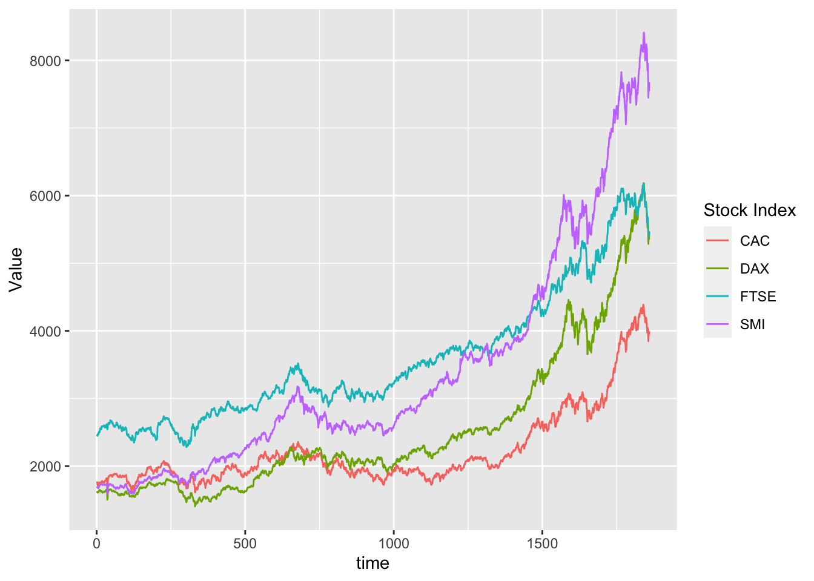

## Tdlyr and ggplot2


::: {.cell}

```{.r .cell-code}
here::i_am("gitr101.Rproj")
```

::: {.cell-output .cell-output-stderr}
```
here() starts at /Users/Marie/Desktop/gitr101
```
:::

```{.r .cell-code}
library(here)
library(ggplot2)
library(dplyr)
```

::: {.cell-output .cell-output-stderr}
```

Attaching package: 'dplyr'
```
:::

::: {.cell-output .cell-output-stderr}
```
The following objects are masked from 'package:stats':

    filter, lag
```
:::

::: {.cell-output .cell-output-stderr}
```
The following objects are masked from 'package:base':

    intersect, setdiff, setequal, union
```
:::

```{.r .cell-code}
library(tidyr)
```
:::

 not include the render in the git representory (ignore everything execpt the ignore fill and qmd file)
 
### Multiple lines on a single graph
 

::: {.cell}

```{.r .cell-code}
eustock <- as.data.frame(EuStockMarkets)
eustock <- eustock |> mutate(time=1:n())
```
:::

::: {.cell}

```{.r .cell-code}
ggplot(eustock, aes(x=time,y=DAX)) +
  geom_line()
```

::: {.cell-output-display}
{width=672}
:::
:::

### Wrong solution

::: {.cell}

```{.r .cell-code}
ggplot(eustock, aes(x=time,y=DAX)) +
  geom_line() +
  geom_line(mapping= aes(y=CAC),color="red")
```

::: {.cell-output-display}
{width=672}
:::
:::

 
Problems: 
- y axis name is wrong
- colors must be specified manuallly
-we miss an association between colors and names 

### Tidlyr based solution 

::: {.cell}

```{.r .cell-code}
long_eustock <- eustock|> pivot_longer(-time, names_to = "Stock Index", values_to="Value")
```
:::

::: {.cell}

```{.r .cell-code}
ggplot(long_eustock, aes(x=time,y=Value, group=`Stock Index`, color=`Stock Index`)) +
  geom_line()
```

::: {.cell-output-display}
{width=672}
:::
:::

::: {.cell}

```{.r .cell-code}
ggplot(long_eustock, aes(x=time,y=Value, color=`Stock Index`)) +
  geom_line()
```

::: {.cell-output-display}
{width=672}
:::
:::

=> same representation but may be harder for some calculation without the group 


::: {.cell}

```{.r .cell-code}
ggplot(long_eustock, aes(x=time,y=Value)) +
  geom_line() + 
  facet_wrap(~`Stock Index`, ncol=1, scale="free_y")
```

::: {.cell-output-display}
{width=672}
:::
:::
